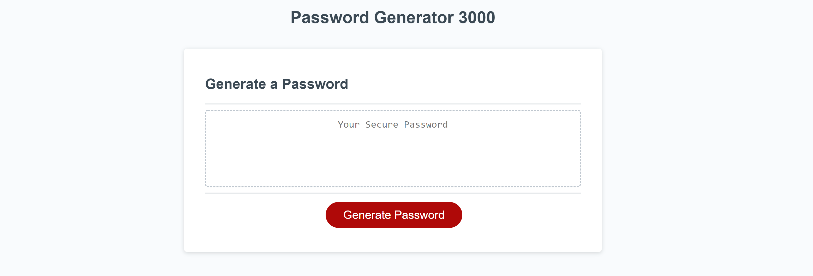

# Password Generator 3000

## The Assignment
For this assignment, students were required to create a functional code generator app built from a startere code provided.

The passwords generated may include special characters/symbols, numbers, uppercase, and lowercase letters. The password length may range anywhere from 8 to 128 characters.

In addition, the user must be given the option to include any and all of the aforementioned options via prompts and confirmation messages.

Modifications within the CSS stylesheet and HTML were also optional to make some of the code work.

## The Process

In order to build the application, JavaScript code had to be added to include variables that were independently selected by the user.
Various strings had to be created for the initial prompts and error/nullified prompts. Alerts were also included to assist in guiding the user to input an appropriate response.

## The Results

My final application included several lines of erroneuos code that seemed fluid but was not 100% functional. Plans to continue to improve the application have been established to reinforce my comfortability with JavaScript.
I left notes labeling items that worked and did not work in an effort to pick up from where I left off.

##The Application in Action!

```
